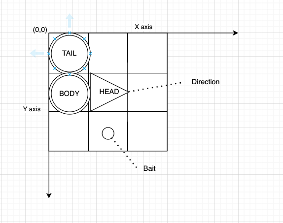

# snake-game
Snake game project


# I. Requirements: 
Snake
- User input the width and height for a matrix.
- The initial length of the snake is 3. Start at 0x0 position
- At one time, only 1 bait is randomly appeared on the screen, but not on the current location of the snake.
- After consume the bait, the length of the snake increase 1 at the head.
- The snake only move by the head by 1 index at the time, it couldn't move backward through it's body.
- The body must follow the head movement or the previous body part. Each step takes 1 second.
- The game ends when:
  + The snake hits the border of the matrix. (Print: You lose)
  + The snake hits itself. (Print: You lose)
  + There is no more place for the snake to move. If the body of the snake cover all of the matrix, print: You win. If not, print: You lose.
- Print to console the snake step by step to find and consume the bait (don't clear the console after each step).


# II.Setup and Run
## 1. System requirements:
- NodeJS v21.5.0
## 2. Run
```
cd ./game
npm install
npm run dev
```
## 3. Open browser
- http://localhost:3000


# Overview & Solutions

- Main components:
    + Timer
        + currentTime
        + 1 step = 1 second
    + Matrix 
      + width
      + height
      + DEFAULT_SIZE=3x3
      + X axis = left -> right
      + Y axis = top -> bottom
    + Snake 
      + DEFAULT_LENGTH=3
      + DEFAULT_POSITION=(0,0)
      + Snake space
      + Snake head
      + Snake tail
      + Snake length
      + Snake direction
      + Movements:
        + Moving to an empty space:
          + Add new head in empty space (with direction)
          + Remove tail
          + Update new tail
          + Replace old head with body
        + Moving to bail space:
          + Add new head in empty space (with direction)
          + Do NOT remove tail
          + Replace old head with body
        + Moving to wall ->(LOSE)
        + Moving to itself ->(LOSE)
    + Bait
      + size=1x1
      + position
      + Generate:
        + 1 and only 1 bait existed in matrix
        + if bait was consumed, generate new bait
        + random in empty space
        + if can not create/generate because no empty space ->(WIN)
    + Console (Browser console)
    + Game state  
      + status
        + INIT
        + STARTED
        + WIN
        + LOSE
    + Controller:
      + input width, height
      + start
      + arrow button
    + Game routing:
      + Home page (/)
        + Welcome
        + Input WIDTH & HEIGHT
        + Start Button
        + Matrix, Snake, Bait
        + Timer
        + Result popup (WIN or LOSE)
        + Restart Button (Reload page)
        
  

  

